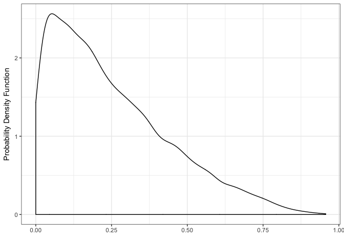

<!-- README.md is generated from README.Rmd. Please edit that file -->
New Package
===========

YOUR NAME

Motivation
----------

This is a test.

Examples
--------

The `beta_plot` function allows you to simulate data from a beta
distribution and plot the results.

    library(ggplot2)
    library(NewPackage)
    beta_plot(a = 1, b = 3)

